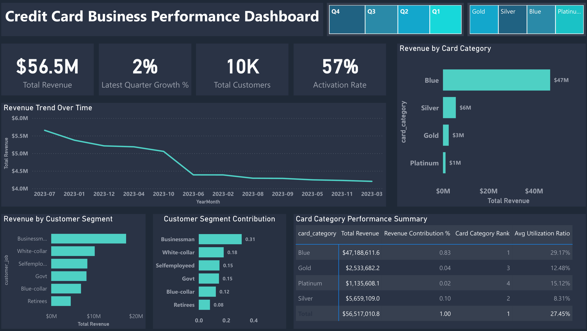
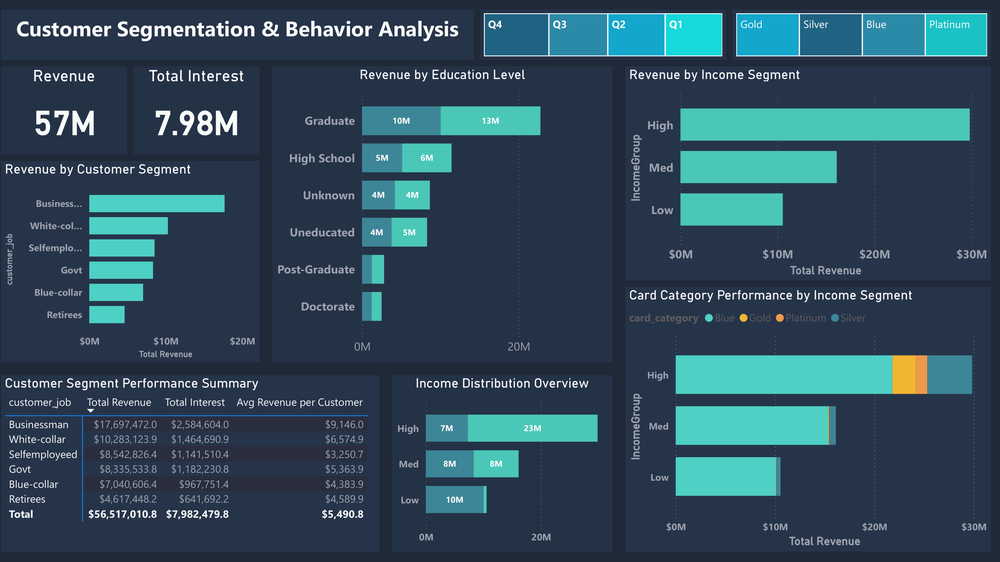

# Credit Card Business Performance Dashboard

## Project Overview

This project presents an interactive Power BI dashboard to analyze credit card business performance and customer behavior. The dashboard focuses on revenue trends, customer segmentation, income groups, and card category performance to support data-driven decision-making.

---

## Dashboard Preview

### Dashboard 1: Credit Card Business Performance



This dashboard provides a high-level overview of business performance. It highlights total revenue, total customers, activation rate, and overall revenue trends. It also shows how different card categories and customer segments contribute to revenue.

### Dashboard 2: Customer Segmentation & Behavior Analysis



This dashboard focuses on customer behavior and segmentation. It analyzes revenue distribution across education levels, income groups, and customer segments, helping identify the most valuable customer profiles.

---

## Key Insights

- Blue card category generates the highest revenue (~$47M)
- Businessman segment is the top revenue contributor
- High-income customers drive the majority of revenue
- Total revenue reached ~$56.5M with a 57% activation rate
- Revenue trend shows a gradual decline over time
- Graduate customers contribute the highest revenue among education levels

---

## Key DAX Techniques Used

### Activation Rate (Safe Division)
```DAX
Activation Rate = 
DIVIDE(
    [Active Customers],
    [Total Customers],
    0
)
```

### Revenue Contribution (% of Total)
```DAX
Revenue Contribution % = 
DIVIDE(
    [Total Revenue],
    CALCULATE([Total Revenue], ALL('Data')),
    0
)
```

### Category Ranking
```DAX
Card Category Rank = 
RANKX(
    ALL('Data'[Card_Category]),
    [Total Revenue],
    ,
    DESC
)
```

### Quarterly Growth
```DAX
Quarterly Growth % = 
VAR PrevRevenue =
    CALCULATE(
        [Total Revenue],
        PREVIOUSQUARTER('Data'[Date])
    )
RETURN
DIVIDE(
    [Total Revenue] - PrevRevenue,
    PrevRevenue,
    0
)
```

---

## Tools & Technologies

- Power BI
- DAX (Data Analysis Expressions)
- Excel (Data Source)

---

## Project Highlights

- Interactive slicers (Quarter, Card Category, Segment)
- KPI tracking (Revenue, Interest, Customers, Activation Rate)
- Customer segmentation and income analysis
- Clean and consistent dark-themed dashboard design

---

## How to Use

1. Open the Power BI file (.pbix)
2. Use slicers to filter data by quarter, category, or segment
3. Explore insights across different visuals

---

## Author

**Rabail Shafeeq**  
Data Analyst | Power BI & DAX  
GitHub: https://github.com/rabailshafeeq
